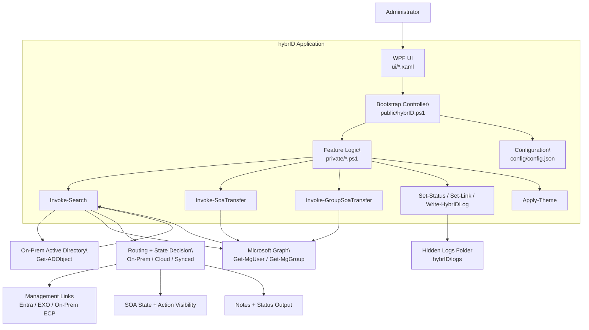

# Architecture

hybrID is a Windows PowerShell 5.1 + WPF desktop tool for hybrid identity triage.

## Design Goals

- Fast operator workflow for helpdesk/admin scenarios
- Clear routing between on-prem and cloud management planes
- Low-friction UI with minimal context switching
- Modular, maintainable PowerShell code structure

## Runtime Stack

- **UI:** WPF XAML (`hybrID/ui/*.xaml`)
- **Controller/Bootstrap:** `hybrID/public/hybrID.ps1`
- **Logic layer:** `hybrID/private/*.ps1`
- **Configuration:** `hybrID/config/config.json`
- **APIs/Dependencies:** Active Directory module + Microsoft Graph PowerShell

## Layer Responsibilities

### `public/hybrID.ps1`

- Determines runtime paths and globals
- Loads XAML and maps controls
- Imports `private/*.ps1`
- Wires event handlers
- Applies theme and launches window

### `private/*.ps1`

Focused feature functions. Examples:

- `Invoke-Search`: object lookup and routing
- `Assert-GraphConnection`: Graph auth gate
- `Invoke-SoaTransfer` / `Invoke-GroupSoaTransfer`: SOA actions
- `Show-Settings` / `Show-About`: child windows
- `Set-Link`, `Set-Status`, `Write-HybrIDLog`: shared utilities

### `ui/*.xaml`

- Main window and child dialogs
- Theme-aware visual resources
- No business logic in XAML

### `config/config.json`

- User-editable settings
- Management URL templates with placeholder replacement

## Search and Routing Flow (High-Level)

1. Read identity input
2. Query AD (`Get-ADObject`)
3. Query Graph (`Get-MgUser`, fallback `Get-MgGroup`)
4. Infer management authority and mailbox/group posture
5. Render links, status, notes, and SOA state/action visibility

## Source of Authority (SOA)

hybrID supports SOA transfer via Graph for supported synced objects:

- User SOA endpoint: `/users/{id}/onPremisesSyncBehavior`
- Group SOA endpoint: `/groups/{id}/onPremisesSyncBehavior`

## Logging and Resilience

- Error paths should use `try/catch`
- User feedback should flow through `Set-Status`
- Operational failures should be captured with `Write-HybrIDLog`

## Extension Pattern

When adding functionality:

1. Add focused function file in `private/`
2. Bind events in `public/hybrID.ps1`
3. Add UI controls in XAML only
4. Add/update tests under `tests/`
5. Update docs (`docs/`) as needed
